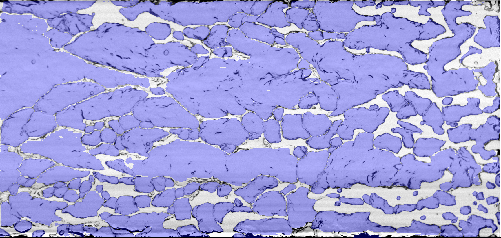

# Bubble Segmentation Using SAM2

[](https://colab.research.google.com/github/AliRKhojasteh/Bubble_segmentation/blob/main/Notebooks/automatic_mask_generator.ipynb)

This is the official repository for **bubble detection and segmentation in fluid experiments** using [SAM2 (Segment Anything Model 2)](https://github.com/facebookresearch/segment-anything-2).

<p align="center">
  
</p>
<p align="center">
  
</p>

The method is described in Appendix B of our paper:

> **Practical object and flow structure segmentation using artificial intelligence**
> Ali R. Khojasteh, Willem van de Water, Jerry Westerweel
> *Experiments in Fluids* (2024) 65:119
> [https://doi.org/10.1007/s00348-024-03852-7](https://doi.org/10.1007/s00348-024-03852-7)


## News

- **2024.07.30**: Paper published in *Experiments in Fluids*.
- **2026.04.01**: First release of Bubble Segmentation repository.

## Overview

Bubbles in fluid experiments present unique segmentation challenges: they are not conventional objects in SAM's training data, they exhibit diverse sizes and shapes, and they undergo hydrodynamic deformations along the channel. This repository provides tools to use SAM2 for robust bubble detection in experimental images.

Key features:

- **Automatic bubble segmentation** using SAM2 with parameters tuned for bubbly flows
- **Interactive mask editing** via a matplotlib-based interface for adding/removing bubble masks
- **Binary mask export** for downstream analysis (e.g., bubble size distributions, void fraction)
- **Colab support** — run the automatic segmentation and post-processing directly in Google Colab, no local setup required
- 10 sample bubble images included for testing

## Quick Start (Google Colab)

The fastest way to get started — no installation required:

1. Click the **"Open in Colab"** badge above (or use the links below)
2. Run all cells — dependencies and model weights are installed automatically
3. The notebook processes the included demo images and shows results

| Notebook | Colab Link | Description |
|----------|------------|-------------|
| `automatic_mask_generator.ipynb` | [](https://colab.research.google.com/github/AliRKhojasteh/Bubble_segmentation/blob/main/Notebooks/automatic_mask_generator.ipynb) | Automatic bubble detection using SAM2 |
| `mask_postprocessing.ipynb` | [](https://colab.research.google.com/github/AliRKhojasteh/Bubble_segmentation/blob/main/Notebooks/mask_postprocessing.ipynb) | Overlay visualization and MATLAB export |
| `interactive_mask_editor.ipynb` | *Local only* | Interactive editor for reviewing and refining masks |

> **Note:** The interactive mask editor requires `%matplotlib widget` and only works in a local Jupyter environment. A non-interactive viewer is included in the notebook for Colab users.

## Local Installation

### 1. Create a conda environment

```bash
conda create -n bubblesam python=3.10 -y
conda activate bubblesam
```

### 2. Clone this repository

```bash
git clone https://github.com/AliRKhojasteh/Bubble_segmentation.git
cd Bubble_segmentation
```

### 3. Install dependencies

```bash
pip install -r requirements.txt
pip install git+https://github.com/facebookresearch/sam2.git
```

### 4. Open the notebooks

```bash
cd Notebooks
jupyter notebook
```

The notebooks will download SAM2 model checkpoints automatically on first run.

## Workflow

1. **Detect bubbles** — Run `automatic_mask_generator.ipynb` to process images and generate masks (saved as pickle files)
2. **Review and refine** — Use `interactive_mask_editor.ipynb` to add missed bubbles or remove false detections (local Jupyter only)
3. **Export results** — Run `mask_postprocessing.ipynb` to create overlay visualizations (PNG) and export binary masks to MATLAB (`.mat`)

## Demo Images

The `Demo/` folder contains 10 sample bubble images (`B0001.png` through `B0010.png`) for testing the pipeline.

## Model Weights

SAM2 model checkpoints are downloaded automatically when running the notebooks. Available models:

| Model | Size | GPU Memory | Speed | Accuracy |
|-------|------|------------|-------|----------|
| `tiny` | 39 MB | ~2 GB | Fastest | Good |
| `small` | 46 MB | ~3 GB | Fast | Better |
| `base_plus` | 81 MB | ~4 GB | Moderate | Very Good |
| `large` | 224 MB | ~6 GB | Slowest | Best |

The default is `large`. Change `MODEL_NAME` in the notebook to use a smaller model.

## Dependencies

- [SAM 2](https://github.com/facebookresearch/segment-anything-2)
- PyTorch >= 2.0
- OpenCV
- NumPy
- Matplotlib (with `ipympl` for the interactive editor)
- SciPy (for MATLAB export)
- Pillow

See [requirements.txt](requirements.txt) for full details.

## Related Repository

This work extends the [Flow Segmentation](https://github.com/AliRKhojasteh/Flow_segmentation) repository, which covers object detection and flow structure segmentation (TNTI, particles, etc.) in fluid experiments.

## Citation

If you use this repository in your research, please cite:

```bibtex
@article{Khojasteh2024,
  author    = {Khojasteh, Ali R. and van de Water, Willem and Westerweel, Jerry},
  title     = {Practical object and flow structure segmentation using artificial intelligence},
  journal   = {Experiments in Fluids},
  volume    = {65},
  pages     = {119},
  year      = {2024},
  doi       = {10.1007/s00348-024-03852-7}
}
```

The bubble segmentation pipeline was developed in the context of the following work (preprint):

```bibtex
@article{Nikolaidou2025,
  author    = {Nikolaidou, Lina and Khojasteh, Ali R. and Laskari, Angeliki and van Terwisga, Tom and Poelma, Christian},
  title     = {Drag reduction regimes in air lubrication},
  journal   = {Journal of Fluid Mechanics},
  year      = {2025},
  note      = {Under consideration for publication, preprint}
}
```

## Contributing

We welcome contributions! In particular:

- Test cases with different bubble configurations (size distributions, densities, lighting conditions)
- Experimental images from various bubbly flow setups (channels, pipes, rising bubbles)
- Improvements to the segmentation pipeline

Please see [CONTRIBUTING.md](CONTRIBUTING.md) for guidelines.

## License

This project is licensed under the Apache License 2.0 - see the [LICENSE](LICENSE) file for details.

## Acknowledgements

The bubbly flow data used in this work is from [Hreiz et al. (2015)](https://doi.org/10.1016/J.CES.2015.04.041).
